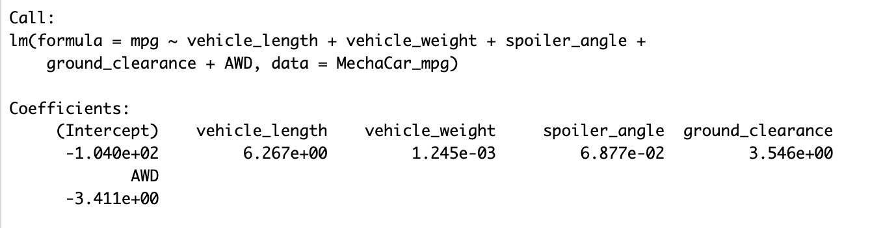

# MechaCar_Statistical_Analysis

## Overview of Project
The purpose of this analysis is to identify which variables in the dataset predict the mpg of MechaCar prototypes, collect summary statistics on the pounds per square inch (PSI) of the suspension coils from the manufacturing lots, determine if the manufacturing lots are statistically different from the mean population using t-tests and compare compare vehicle performance of the MechaCar vehicles against vehicles from other manufacturers. The calculations were done with R on R Studio.

## Linear Regression to Predict MPG
 The dataset given contained a sample size of 50 prototypes measuring the miles per gallon across multiple variables. The summary of the linear regression can be used to determine the quality of the dataset. The dataset fits in with the normal parameters as the absolute value of the min and max are comparable -19.47 and 18.58, and the median -.07 being close to zero.

 
 1. Which variables/coefficients provided a non-random amount of variance to the mpg values in the dataset?
 The p-value should be compared to alpha = .05 level of significance to verify if statistically significant. In conclusion, the coefficient/variables that provide non-random amount of variance to the mpg values are vehicle length and ground clearance.
 
 2. Is the slope of the linear model considered to be zero? Why or why not?
 The slope of the linear model is not zero. The slope coefficients contain significant non-zero values. This includes vehicle length, ground clearance, and AWD), and the p-values are less than the significance level of p=0.05.
 
 3. Does this linear model predict mpg of MechaCar prototypes effectively? Why or why not?
 R-squared is 0.7149, which is a strong correlation for the dataset and shows the model is an effective predictor of the mpg values.
 
 
 ## Summary Statistics on Suspension Coils
### Manufacturing Lot Summary
This is the summary statistics of all of the manufacturing lots. The mean is 1498.78 from the sample and the population mean was determined 

 

### Summary by Manufacturing Lot Number
The means of each manufacturing lot is displayed below and it is similar to the total mean.

 

1. The design specifications for the MechaCar suspension coils dictate that the variance of the suspension coils must not exceed 100 pounds per square inch. Does the current manufacturing data meet this design specification for all manufacturing lots in total and each lot individually? Why or why not?

The variance for the total manufacturing lot is 62 < 100. This means it is within the expected design specifications, which is being under 100 PSI. Although, when looking at each lot, Lot 3 has a very high variance: 170 > 100. Therefore, lot 3 does not meet the design specifications while lot 1 and 2 have lower variance.

## T-Tests on Suspension Coils
### T-test for all Lots
All Manufacturing Lots: p-value = 0.6028, alpha = 0.05
0.60 > 0.05, which means the total manufacturing lot is not statistically significant from the normal distribution. The mean falls within the 95% confidence interval.

 

### T-test for Lot 1
Lot 1: p-value = 1, alpha = 0.05
1 > 0.05, which means Lot 1 is not statistically significant from the normal distribution and normality can be assumed. The mean falls within the 95% confidence interval.

 

### T-test for Lot 2
Lot 2: p-value = 0.6072, alpha = 0.05
0.61 > 0.05, this means Lot 2 is not statistically significant from the normal distribution. The mean falls within the 95% confidence interval.

 

### T-test for Lot 3
Lot 3: p-value = 0.04168, alpha = 0.05
0.041 < 0.05, which means it is statistically significant from the normal distribution and normality cannot be assumed. However, the mean falls within the 95% confidence interval.

 

## Study Design: MechaCar vs Competition

To compare MechaCar to its competitor, we would need to address some metrics that could be of interest to a consumer. These include cost, car color, city fuel efficiency, highway fuel efficiency, horsepower, maintenance cost, or safety rating.

What metric or metrics are you going to test?
One of the primary concerns when driving a car, is the safety component. Consumers would like to drive a car that meets the safety measures when on the road. The possible metrics to test should be the safety rating, horsepower, and highway fuel efficiency, which address some safety concerns of consumers, and illustrating how it would perform better than its competitors.

What is the null hypothesis or alternative hypothesis?
The null hypothesis is that the mean of the safety rating is zero. The alternative hypothesis is that the mean of the safety rating is not zero.

What statistical test would you use to test the hypothesis? And why?
The statistical test used would be multiple linear regression summary would show how the variables affect the safety ratings looking at the car's efficiency for MechaCar and their competitors.

What data is needed to run the statistical test?
A random sample data set, their safety rating, highway fuel efficiency and horsepower of MechaCar and their competitors would need to be collected. This data would be analyzed using R on R Studio.
